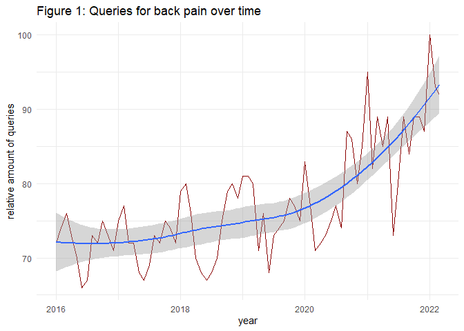
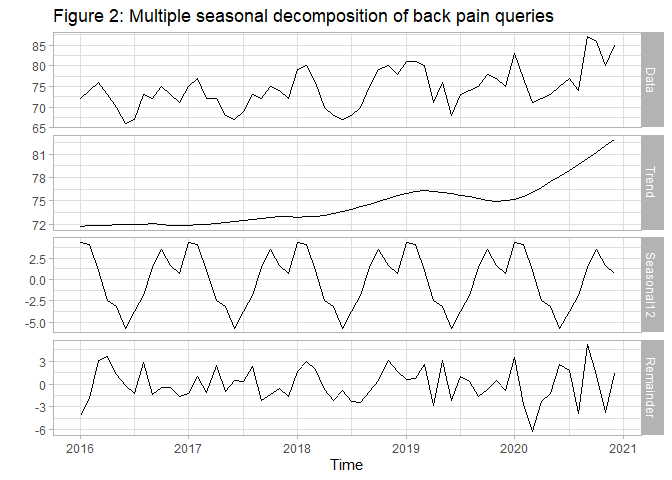
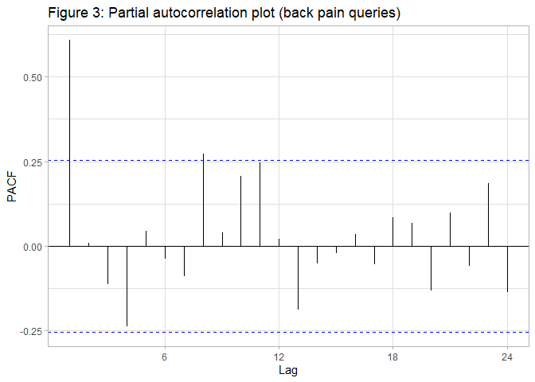

# Trends in Back Pain
Florian Klohn, 15 Apr 2022 (first version 16 Oct 2021)

``` r
#Preliminaries:
knitr::opts_chunk$set(message=FALSE, warning=FALSE)

rm(list=ls())

library(tidyverse)
library(lubridate)
library(viridis)
library(gtrendsR)
library(forecast)
library(jtools)
library(sandwich)

theme_set(theme_light())

dir.create("filesTrends", showWarnings = FALSE)
```

## Introduction

Back pain is a common issue across the globe, increasing due to an
ageing population and little physical exercise (the latter is usually
considered a good ingredient to improve the situation). However, from
2020 onward, exercise decreased strongly due to policies to mitigate the
COVID-19 pandemic. Hence, a natural question is whether political
lockdown had a negative influence on the prevalence of back pain. One
potential mechanism could be a higher number of people working from
home. But how to detect changes in back pain over time? One way to
approach this is to use [Google
Trends](https://trends.google.de/trends), as it provides quasi-instant
access to aggregated queries from Google users. Hoerger et al. (2020),
Knipe et al. (2020) and Brodeur et al. (2021) use Google Trends to
assess the impact of the pandemic on mental health/well-being. Szilagyi
et al. (2021) compare queries for back pain, before and after the
pandemic. The seasonality of back pain in Italy was analyzed by Ciaffi
et al. (2021). But can health issues really be traced back to the
COVID-19 pandemic, and how?

## Data Analysis

Let us figure out the relative amount of internet queries for back
pain-related keywords from 2016 onward. We focus on queries from Germany
and assume that the back pain synonyms ‘Rückenschmerzen’, ‘Rücken
Schmerzen’, ‘Rückenschmerz’, ‘Rücken Schmerz’, reflect the overall
interest in this topic, as a proxy for the associated burden of disease
over time. Data is provided on a monthly level.

``` r
#trends <- gtrends(keyword = c("Schmerz Rücken + Rückenschmerz + Schmerzen Rücken + Rückenschmerzen"), time = #'2016-01-01 2022-03-31', geo="DE")
#write_rds(trends, "filesTrends/trends_ruecken20220415.rds")
trends <- read_rds("filesTrends/trends_ruecken20220415.rds")

#transform important variables 
trends$interest_over_time  <- trends$interest_over_time %>%
        mutate(date=as.Date(date))

#Visualize Backpain over time
trends$interest_over_time %>%
  ggplot() +
  geom_line(aes(x=date, y=hits),  color = "darkred") +
  geom_smooth(aes(x=date, y=hits)) +
  theme_minimal() +
  scale_colour_viridis_d(option="viridis") +
  labs(y="relative amount of queries", x="year", title="Figure 1: Queries for back pain over time")
```

<!-- -->

We see in Figure 1 that the relative number of queries is increasing
steadily over time, ie there is a positive time trend. In order to
better understand the data structure let us now decompose, trend,
seasonality and error (using just complete 12-year periods):

``` r
#create time series:
ts_in <- trends$interest_over_time %>%
  filter(date>= '2016-01-01' & date<= '2020-12-31') %>%
  mutate(Jahr=year(date)) %>%
  select(hits) %>% 
  pull()

back_ts <- ts(ts_in, start = c(2016, 1),   frequency = 12) 

dcp <- mstl(back_ts, s.window="periodic")
autoplot(dcp) +
  labs(title="Figure 2: Multiple seasonal decomposition of back pain queries")
```

<!-- -->

A monthly seasonal pattern can be seen which we should keep in mind when
analyzing the relationship between the pandemic with back pain. Due to
the time structure of our data also autocorrelation is a potential issue
we should be aware of.

``` r
ggPacf(back_ts, main="Figure 3: Partial autocorrelation plot (back pain queries)")
```

<!-- -->

A strong partial autocorrelation with monthly lags can be seen which
should be taken into account as well. Let us put together what we have
learned so far, in order to assess whether the COVID-19 period is
statistically associated with Google queries for back pain: We do so by
applying *segmented regression analysis* (e.g. Wagner et al. 2002; Jebb
et al. 2015) assuming an interrupted linear time trend in our model. The
dependent variable $hits_t$ reflects the relative amount of queries for
back pain over months $t$ and is considered in logarithmic form.
Explanatory variable $time_t$ is added to account for an assumed (partly
*counterfactual*) linear time trend. Since lockdown policies began in
Germany on 2020-3-16, we test for a level change at the beginning of
treatment by adding a dummy variable $P_t$ to the specification. As the
back pain trend may change during the lockdown, we add another time
variable $time\:since\:treatment_t$ to the specification – capturing
time since treatment, zero before. This leads to the following
regression:

<center>

$log(hits_t) = \beta_0 + \beta_1\,time_t + \beta_2\,P_t + \beta_3\:time\,since\:treatment_t + \epsilon_t$

</center>

Finally, dummy variables for each month are added to our specification
in order to capture the seasonality of queries for back pain, as
discussed above. The autocorrelated residuals are accounted for by using
Newey-West standard errors.

``` r
data_impact <- trends$interest_over_time %>%
  arrange(date) %>%
  mutate(time=row_number()-1, month=as.factor(month(date)), hits_l1=dplyr::lag(hits),     
         policy=if_else(date>=as.Date('2020-03-16'), 1, 0),
         min_time_2=min(if_else(policy==1, row_number(), NA_integer_), na.rm=TRUE)-1
         , time_2=ifelse(policy==1, row_number()-min_time_2, 0))

lm_out <- lm(log(hits) ~ time + month  + policy + time_2, data=data_impact)

ipct_out <- round(exp(lm_out$coefficients["time_2"])*100-100, 3)

summ(lm_out, vcov=NeweyWest(lm_out, lag=8, prewhite=TRUE, adjust=TRUE), digits = 3) 
```

<table class="table table-striped table-hover table-condensed table-responsive" style="width: auto !important; margin-left: auto; margin-right: auto;">
<tbody>
<tr>
<td style="text-align:left;font-weight: bold;">
Observations
</td>
<td style="text-align:right;">
75
</td>
</tr>
<tr>
<td style="text-align:left;font-weight: bold;">
Dependent variable
</td>
<td style="text-align:right;">
log(hits)
</td>
</tr>
<tr>
<td style="text-align:left;font-weight: bold;">
Type
</td>
<td style="text-align:right;">
OLS linear regression
</td>
</tr>
</tbody>
</table>
<table class="table table-striped table-hover table-condensed table-responsive" style="width: auto !important; margin-left: auto; margin-right: auto;">
<tbody>
<tr>
<td style="text-align:left;font-weight: bold;">
F(14,60)
</td>
<td style="text-align:right;">
26.204
</td>
</tr>
<tr>
<td style="text-align:left;font-weight: bold;">
R²
</td>
<td style="text-align:right;">
0.859
</td>
</tr>
<tr>
<td style="text-align:left;font-weight: bold;">
Adj. R²
</td>
<td style="text-align:right;">
0.827
</td>
</tr>
</tbody>
</table>
<table class="table table-striped table-hover table-condensed table-responsive" style="width: auto !important; margin-left: auto; margin-right: auto;border-bottom: 0;">
<thead>
<tr>
<th style="text-align:left;">
</th>
<th style="text-align:right;">
Est.
</th>
<th style="text-align:right;">
S.E.
</th>
<th style="text-align:right;">
t val.
</th>
<th style="text-align:right;">
p
</th>
</tr>
</thead>
<tbody>
<tr>
<td style="text-align:left;font-weight: bold;">
(Intercept)
</td>
<td style="text-align:right;">
4.344
</td>
<td style="text-align:right;">
0.018
</td>
<td style="text-align:right;">
240.725
</td>
<td style="text-align:right;">
0.000
</td>
</tr>
<tr>
<td style="text-align:left;font-weight: bold;">
time
</td>
<td style="text-align:right;">
0.001
</td>
<td style="text-align:right;">
0.000
</td>
<td style="text-align:right;">
2.833
</td>
<td style="text-align:right;">
0.006
</td>
</tr>
<tr>
<td style="text-align:left;font-weight: bold;">
month2
</td>
<td style="text-align:right;">
-0.035
</td>
<td style="text-align:right;">
0.025
</td>
<td style="text-align:right;">
-1.418
</td>
<td style="text-align:right;">
0.161
</td>
</tr>
<tr>
<td style="text-align:left;font-weight: bold;">
month3
</td>
<td style="text-align:right;">
-0.054
</td>
<td style="text-align:right;">
0.021
</td>
<td style="text-align:right;">
-2.567
</td>
<td style="text-align:right;">
0.013
</td>
</tr>
<tr>
<td style="text-align:left;font-weight: bold;">
month4
</td>
<td style="text-align:right;">
-0.106
</td>
<td style="text-align:right;">
0.021
</td>
<td style="text-align:right;">
-5.059
</td>
<td style="text-align:right;">
0.000
</td>
</tr>
<tr>
<td style="text-align:left;font-weight: bold;">
month5
</td>
<td style="text-align:right;">
-0.109
</td>
<td style="text-align:right;">
0.022
</td>
<td style="text-align:right;">
-4.969
</td>
<td style="text-align:right;">
0.000
</td>
</tr>
<tr>
<td style="text-align:left;font-weight: bold;">
month6
</td>
<td style="text-align:right;">
-0.174
</td>
<td style="text-align:right;">
0.023
</td>
<td style="text-align:right;">
-7.454
</td>
<td style="text-align:right;">
0.000
</td>
</tr>
<tr>
<td style="text-align:left;font-weight: bold;">
month7
</td>
<td style="text-align:right;">
-0.135
</td>
<td style="text-align:right;">
0.017
</td>
<td style="text-align:right;">
-7.927
</td>
<td style="text-align:right;">
0.000
</td>
</tr>
<tr>
<td style="text-align:left;font-weight: bold;">
month8
</td>
<td style="text-align:right;">
-0.096
</td>
<td style="text-align:right;">
0.024
</td>
<td style="text-align:right;">
-3.987
</td>
<td style="text-align:right;">
0.000
</td>
</tr>
<tr>
<td style="text-align:left;font-weight: bold;">
month9
</td>
<td style="text-align:right;">
-0.073
</td>
<td style="text-align:right;">
0.019
</td>
<td style="text-align:right;">
-3.899
</td>
<td style="text-align:right;">
0.000
</td>
</tr>
<tr>
<td style="text-align:left;font-weight: bold;">
month10
</td>
<td style="text-align:right;">
-0.039
</td>
<td style="text-align:right;">
0.015
</td>
<td style="text-align:right;">
-2.563
</td>
<td style="text-align:right;">
0.013
</td>
</tr>
<tr>
<td style="text-align:left;font-weight: bold;">
month11
</td>
<td style="text-align:right;">
-0.061
</td>
<td style="text-align:right;">
0.021
</td>
<td style="text-align:right;">
-2.857
</td>
<td style="text-align:right;">
0.006
</td>
</tr>
<tr>
<td style="text-align:left;font-weight: bold;">
month12
</td>
<td style="text-align:right;">
-0.075
</td>
<td style="text-align:right;">
0.014
</td>
<td style="text-align:right;">
-5.513
</td>
<td style="text-align:right;">
0.000
</td>
</tr>
<tr>
<td style="text-align:left;font-weight: bold;">
policy
</td>
<td style="text-align:right;">
0.025
</td>
<td style="text-align:right;">
0.014
</td>
<td style="text-align:right;">
1.828
</td>
<td style="text-align:right;">
0.073
</td>
</tr>
<tr>
<td style="text-align:left;font-weight: bold;">
time_2
</td>
<td style="text-align:right;">
0.005
</td>
<td style="text-align:right;">
0.001
</td>
<td style="text-align:right;">
4.011
</td>
<td style="text-align:right;">
0.000
</td>
</tr>
</tbody>
<tfoot>
<tr>
<td style="padding: 0; " colspan="100%">
<sup></sup> Standard errors: User-specified
</td>
</tr>
</tfoot>
</table>

Our regression shows that the COVID-19 time period is indeed associated
with a higher share of queries for back pain, given a linear time trend
and month-flags. However, although positive, the level change after
treatment lacks statistical significance (p\>0.05). Instead, compared to
the baseline, we find a steady increase in relative queries from the
beginning of the lockdown onward. From this point queries increased
around $(e^{\hat{\beta}_3}-1)\cdot100=$`0.518` percent each month – in
addition to the assumed counterfactual time trend $\beta_1$. This
suggests that although people were saved concerning a COVID-19
infection, there seems to be a negative external effect on other health
outcomes in Germany (in addition to the psychological and economic
burden).

## Conclusion

Overall we have found a substantial increase in the relative interest in
back pain based on online queries using Google Trends. What can be done?
From a policy perspective, it is clear that there needs to be enough
supply of health care provision for sufficient treatment, mitigation of
pain, and avoidance of chronic disease. Another important aspect of back
pain treatment often is a person’s self-awareness, to successfully
figure out what he or she needs and when and what exercises to do. Here,
in addition to professional help, [digital
services](https://letmegooglethat.com/?q=back+pain+help) can support to
access information easily and provide tools in order to relieve pain –
given high-quality information is provided.

One thing we have to keep in mind is that Google Trends reflect the
importance of queries, relative to all queries at a point in time at a
specific location. It is obvious that overall internet queries increased
strongly in 2020. So our results from above suggest that back pain
queries increased even more strongly.

Generally, we can imagine that process-data from internet companies
allows to address a lot of interesting questions. Indeed,
Stephens-Davidowitz (2018) argues that people’s thoughts/motivations are
much more honestly reflected in their internet searches, as compared to
answering survey questions.

## References

<div id="refs" class="references csl-bib-body hanging-indent">

<div id="ref-brodeur2021covid" class="csl-entry">

Brodeur, Abel, Andrew E Clark, Sarah Fleche, and Nattavudh Powdthavee.
2021. “COVID-19, Lockdowns and Well-Being: Evidence from Google Trends.”
*Journal of Public Economics* 193: 104346.

</div>

<div id="ref-ciaffi2021seasonality" class="csl-entry">

Ciaffi, Jacopo, Riccardo Meliconi, Maria Paola Landini, Luana
Mancarella, Veronica Brusi, Cesare Faldini, and Francesco Ursini. 2021.
“Seasonality of Back Pain in Italy: An Infodemiology Study.”
*International Journal of Environmental Research and Public Health* 18
(3): 1325.

</div>

<div id="ref-hoerger2020impact" class="csl-entry">

Hoerger, Michael, Sarah Alonzi, Laura M Perry, Hallie M Voss, Sanjana
Easwar, and James I Gerhart. 2020. “Impact of the COVID-19 Pandemic on
Mental Health: Real-Time Surveillance Using Google Trends.”
*Psychological Trauma: Theory, Research, Practice, and Policy* 12 (6):
567.

</div>

<div id="ref-p2" class="csl-entry">

Hyndman, Rob, George Athanasopoulos, Christoph Bergmeir, Gabriel
Caceres, Leanne Chhay, Mitchell O’Hara-Wild, Fotios Petropoulos, Slava
Razbash, Earo Wang, and Farah Yasmeen. 2021.
*<span class="nocase">forecast</span>: Forecasting Functions for Time
Series and Linear Models*. <https://pkg.robjhyndman.com/forecast/>.

</div>

<div id="ref-jebb2015time" class="csl-entry">

Jebb, Andrew T, Louis Tay, Wei Wang, and Qiming Huang. 2015. “Time
Series Analysis for Psychological Research: Examining and Forecasting
Change.” *Frontiers in Psychology* 6: 727.

</div>

<div id="ref-knipe2020mapping" class="csl-entry">

Knipe, Duleeka, Hannah Evans, Amanda Marchant, David Gunnell, and Ann
John. 2020. “Mapping Population Mental Health Concerns Related to
COVID-19 and the Consequences of Physical Distancing: A Google Trends
Analysis.” *Wellcome Open Research* 5.

</div>

<div id="ref-p3" class="csl-entry">

Long, Jacob A. 2020. *Jtools: Analysis and Presentation of Social
Scientific Data*. <https://cran.r-project.org/package=jtools>.

</div>

<div id="ref-p1" class="csl-entry">

Massicotte, Philippe, and Dirk Eddelbuettel. 2021. *gtrendsR: Perform
and Display Google Trends Queries*.
<https://CRAN.R-project.org/package=gtrendsR>.

</div>

<div id="ref-stephens2018everybody" class="csl-entry">

Stephens-Davidowitz, Seth. 2018. *Everybody Lies: What the Internet Can
Tell Us about Who We Really Are*. Bloomsbury Publishing.

</div>

<div id="ref-szilagyi2021google" class="csl-entry">

Szilagyi, Istvan-Szilard, Torsten Ullrich, Kordula Lang-Illievich,
Christoph Klivinyi, Gregor Alexander Schittek, Holger Simonis, and
Helmar Bornemann-Cimenti. 2021. “Google Trends for Pain Search Terms in
the World’s Most Populated Regions Before and After the First Recorded
COVID-19 Case: Infodemiological Study.” *Journal of Medical Internet
Research* 23 (4): e27214.

</div>

<div id="ref-wagner2002segmented" class="csl-entry">

Wagner, Anita K, Stephen B Soumerai, Fang Zhang, and Dennis Ross-Degnan.
2002. “Segmented Regression Analysis of Interrupted Time Series Studies
in Medication Use Research.” *Journal of Clinical Pharmacy and
Therapeutics* 27 (4): 299–309.

</div>

<div id="ref-p4" class="csl-entry">

Zeileis, Achim, Susanne Köll, and Nathaniel Graham. 2020. “Various
Versatile Variances: An Object-Oriented Implementation of Clustered
Covariances in R.” *Journal of Statistical Software* 95 (1): 1–36.
<https://doi.org/10.18637/jss.v095.i01>.

</div>

</div>
